# 👋 ¡Hola! Soy Iván Quintero

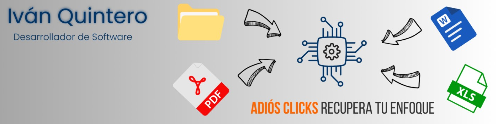

**Desarrollador-Consultor especializado en el sector salud.**  
Construyo soluciones digitales a medida para clínicas, profesionales de salud y empresas que necesitan sistemas funcionales, escalables y centrados en el usuario real.

## 💼 ¿Qué hago?

✅ Desarrollo plataformas completas con Django + JS + PostgreSQL  
✅ Automatizo procesos con IA y herramientas de productividad  
✅ Diseño dashboards de análisis clínico y operativo  
✅ Actúo como puente entre la visión del negocio y la ejecución técnica

## 🎯 Mi diferencia

> **No soy solo un programador.**  
> Soy el que entiende tu clínica, traduce tus ideas, y construye lo que realmente necesitas.

Trabajo con visión de producto, no solo de código.  
Pienso junto a tí. Propongo. Estructuro. Ejecuto.

## 🤝 ¿Cómo trabajo?

🔹 Tengo un cupo muy lmimitado de clientes para ofrecer atención personalizada  
🔹 Acompaño desde la estrategia hasta el desarrollo  
🔹 Cada proyecto es tratado como si fuera mío

## 💼 **Habilidades:**

## 🚀 Mis Principales Proyectos:

### 🏥 [Proyecto de Urología - Estudio de Caso](https://github.com/quinterodev/urologia_estudiodecaso)
📌 **Desarrollo de software para gestión médica.**  
✅ Reducción del tiempo administrativo en un 50%.  
✅ Seguimiento automatizado de pacientes con gráficos y reportes.  
✅ Seguridad avanzada con encriptación y control de acceso por roles.  
✅ Generación de informes personalizados y análisis avanzados de datos.  
🔹 **Tecnologías:** Django, PostgreSQL, Bootstrap, JavaScript, Environ.

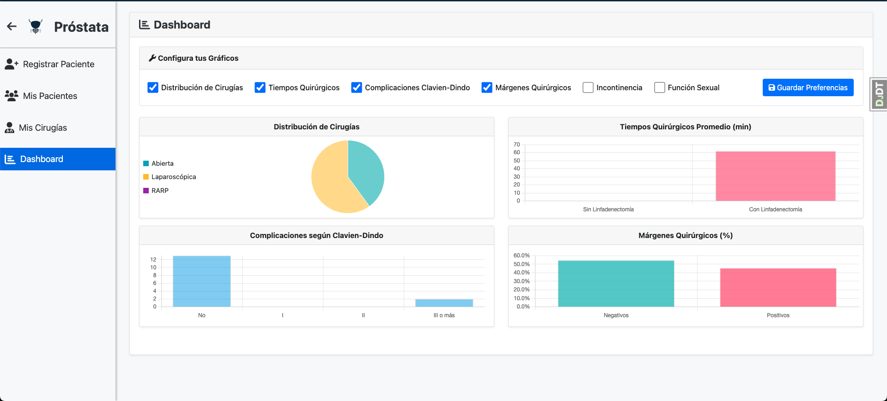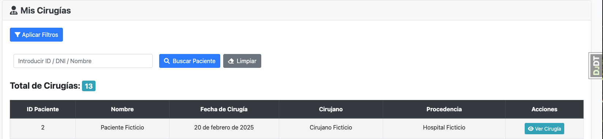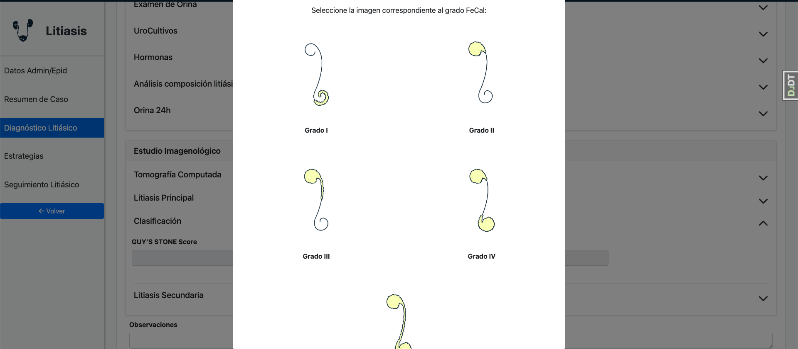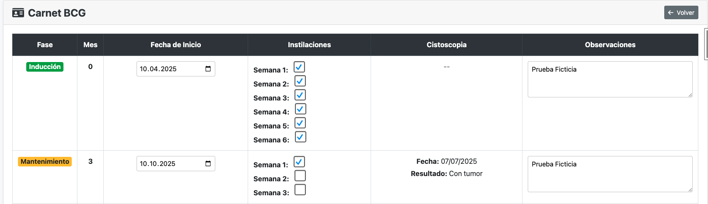

---

### 🏥 [Plataforma para Clínica de Patologías Digestivas - Estudio de Caso](https://github.com/quinterodev/clinica_digestiva_estudiocaso)
📌 **Solución integral para la gestión clínica y operativa.**  
✅ Centralización de datos clínicos y marketing en un único sistema.  
✅ Creación de protocolos médicos automatizados y tratamientos personalizados.  
✅ Chat interno para mejorar la comunicación entre médicos y pacientes.  
✅ Interacción activa del paciente con la plataforma mediante cuestionarios y diarios de seguimiento.  
✅ Exportación de datos en CSV y Excel con reportes avanzados.  
🔹 **Tecnologías:** Django, PostgreSQL, Bootstrap, JavaScript, Environ.

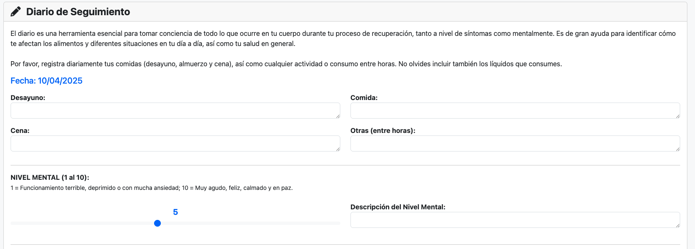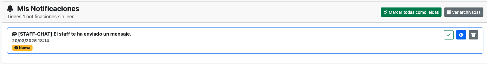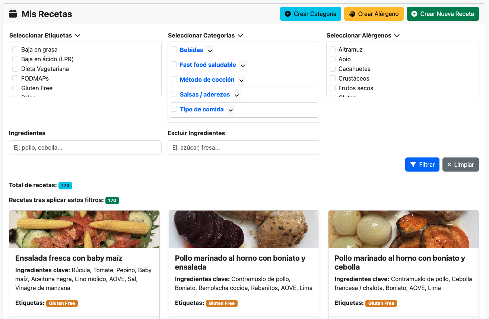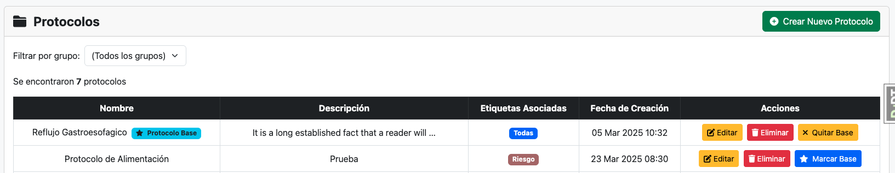
---

### 📚 [Codmentor](https://github.com/QuinteroDev/codmentor)

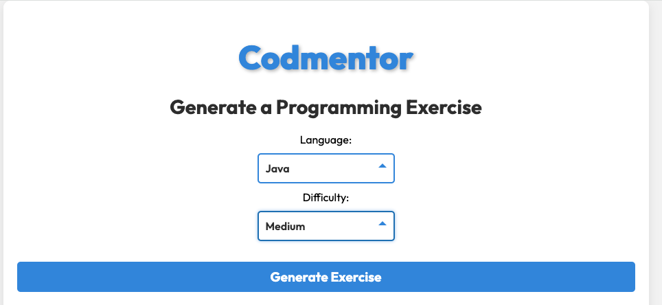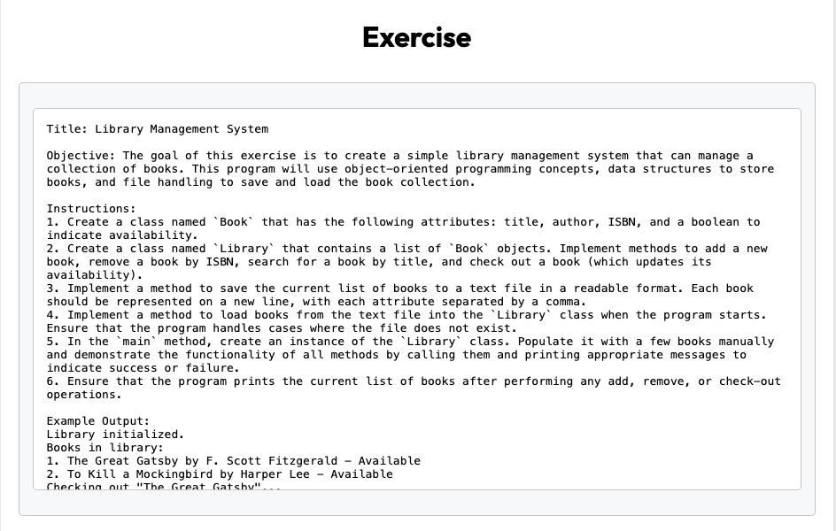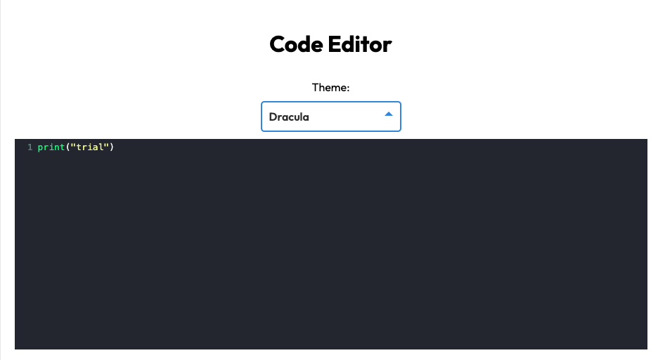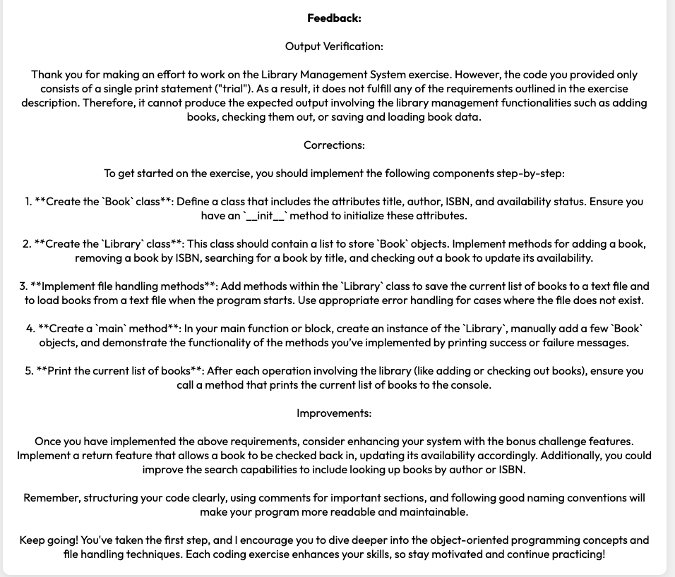

**Descripción:** CodMentor es una plataforma educativa innovadora diseñada para mejorar las habilidades de programación mediante ejercicios dinámicos generados con la API de OpenAI. Permite a los usuarios escribir y ejecutar código en tiempo real en un editor interactivo. La plataforma admite múltiples lenguajes de programación y proporciona retroalimentación detallada. Desplegado con Gunicorn y Nginx, con integración segura HTTPS vía Let’s Encrypt.

### 💰 [KakeboAPP](https://github.com/QuinteroDev/KakeboAPP_public)

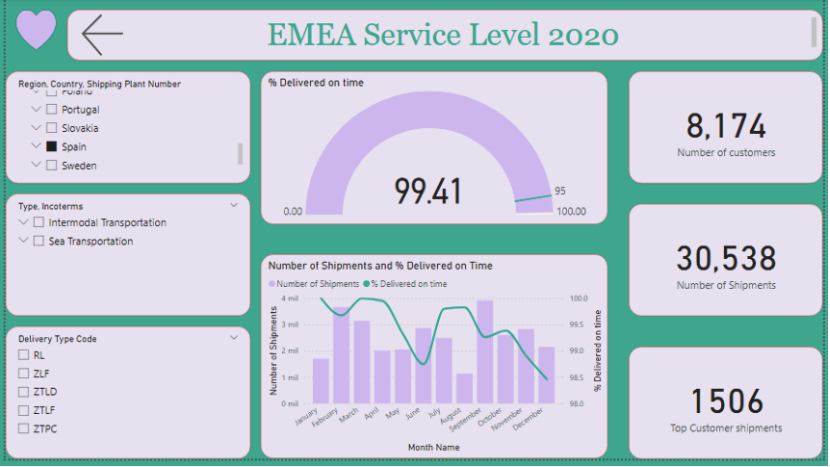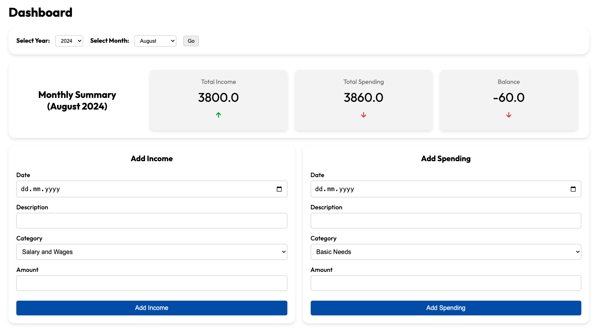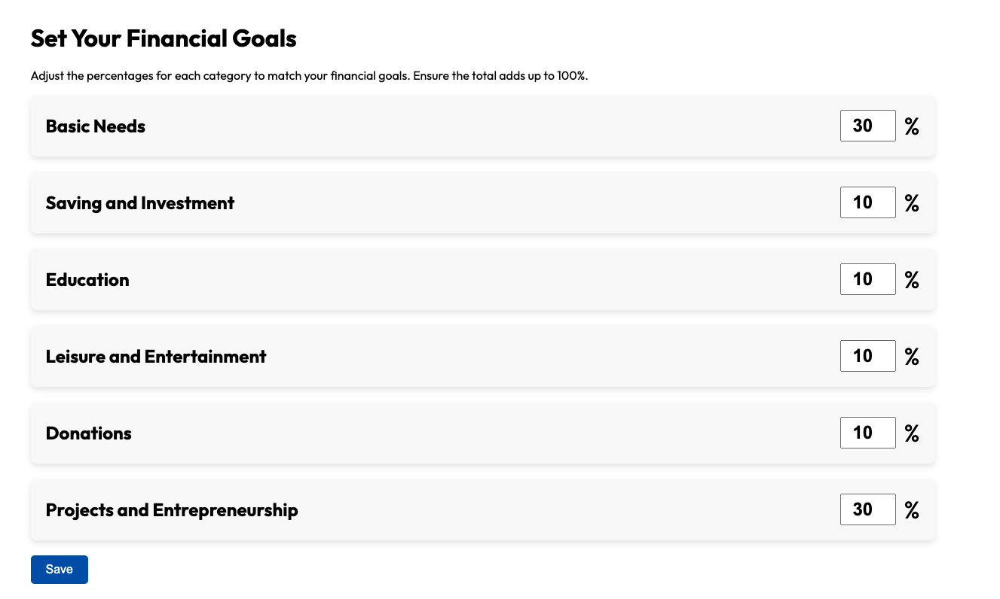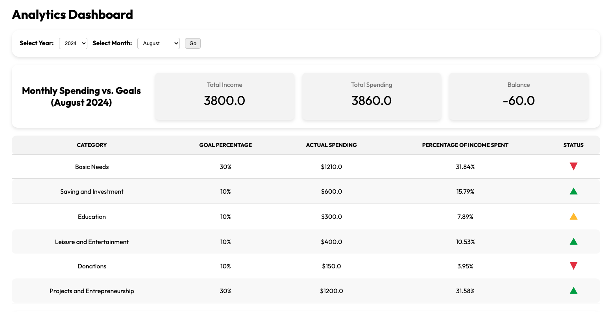

**Descripción:**  
KakeboAPP es una herramienta integral para la gestión de finanzas personales inspirada en el método japonés de Kakeibo. Ayuda a los usuarios a rastrear ingresos y gastos, establecer objetivos financieros y analizar patrones de gasto. Desarrollado en Django, con un backend optimizado para manejar datos financieros complejos y un frontend moderno y fácil de usar. Desplegado en DigitalOcean con Nginx y Gunicorn, con integración HTTPS segura vía Let’s Encrypt.

### 🛠 [Extension VS Code DJTemplates-Autocomplete](https://github.com/QuinteroDev/djtemplates-autocomplete)

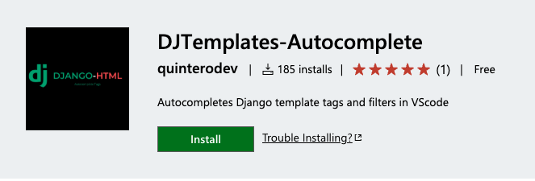

**Descripción:**  
DJTemplates-Autocomplete es una extensión de Visual Studio Code diseñada para mejorar la eficiencia de los desarrolladores que trabajan con plantillas de Django. Proporciona autocompletado para etiquetas y filtros de Django, facilitando el desarrollo. Incluye snippets para bloques como , , , entre otros. Disponible en el VSCode Marketplace. Desarrollado en TypeScript y probado para compatibilidad con las últimas versiones de VSCode.

## 🏢  Empresas con las que he trabajado:

  
  
  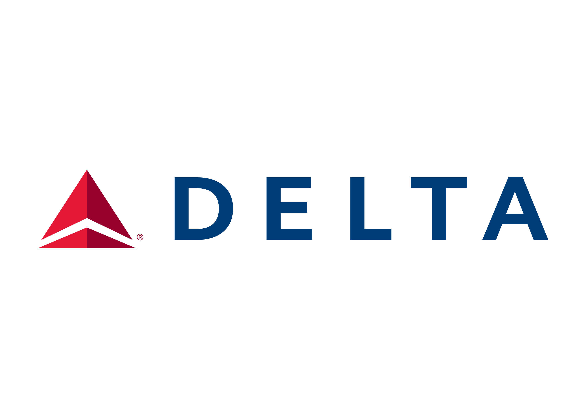
  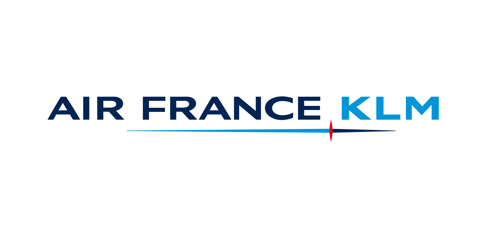

## 📫 Cómo contactarme:

- Email: [info@quinterodev.com](mailto:info@quinterodev.com)
- LinkedIn: [Iván Ruiz](www.linkedin.com/in/quinterodev)

## 📊 Estadísticas de GitHub:

