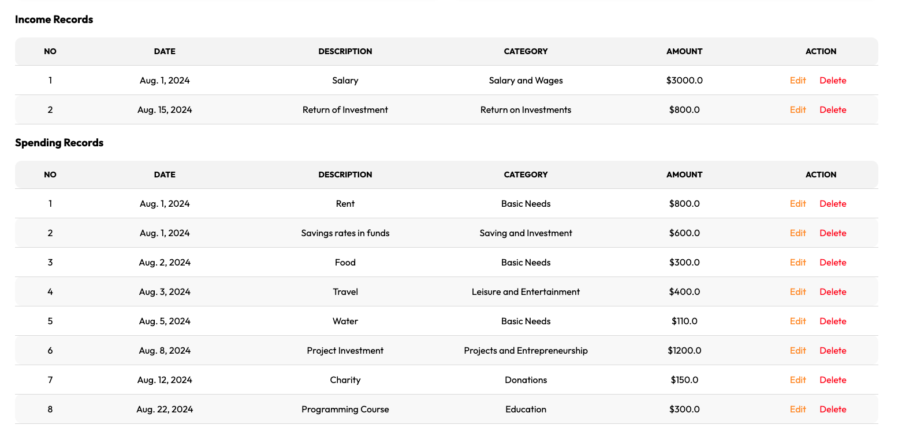

# Hi there! I'm Quintero 👋

## 🚀 About Me:

I’m Quintero, a passionate technologist with a knack for solving complex problems through code and data. My journey in tech is fueled by a relentless curiosity and a drive to continually learn and evolve.

Currently, I’m channeling my entrepreneurial spirit as an Amazon Seller, where I focus on the pet products niche. This venture has honed my skills in e-commerce, product management, and customer-centric strategies.

On the technical side, I’m a skilled software developer with a deep understanding of both front-end and back-end technologies. My experience spans various programming languages and frameworks, enabling me to build robust, scalable applications tailored to specific business needs.

In addition to my development expertise, I have a strong background in data analysis. I recently earned certification in Microsoft Power BI, which has expanded my ability to turn raw data into actionable insights. Whether it’s through data visualization or predictive modeling, I thrive on making data-driven decisions that drive growth and innovation.

Outside of work, I’m an avid explorer—whether it’s hiking new trails or diving into the rich histories and cultures of different regions. I believe in the power of continuous learning and personal growth, and I apply this philosophy both in my professional and personal life.

Let’s connect and create something amazing together!

## 💼 **Skills:**

## 🚀 My Projects:

### [Project 1: Codmentor](https://github.com/QuinteroDev/codmentor)

**Description:** CodMentor is an innovative educational platform designed to enhance programming skills by providing users with dynamic exercises generated using the OpenAI API. The platform features an interactive code editor, where users can write and execute code in real-time. With support for multiple programming languages and detailed feedback mechanisms, CodMentor is the ideal tool for developers looking to improve their coding abilities. The project is deployed using modern tools like Gunicorn and Nginx, with secure HTTPS integration via Let's Encrypt.

### [Project 2: KakeboAPP](https://github.com/QuinteroDev/KakeboAPP_public)

**Description:**  
KakeboAPP is a comprehensive personal finance management tool inspired by the traditional Japanese method of Kakeibo. The application is designed to help users track their income and expenses, set financial goals, and analyze their spending patterns over time. KakeboAPP was developed using Django and features a robust backend capable of handling complex financial data. The frontend is styled with modern CSS to ensure a clean and user-friendly interface. The project was deployed on a DigitalOcean droplet using Nginx and Gunicorn, with secure HTTPS integration via Let's Encrypt.

### [Project 3: Extension VS Code DJTemplates-Autocomplete](https://github.com/QuinteroDev/djtemplates-autocomplete)

**Description:**  
DJTemplates-Autocomplete is a Visual Studio Code extension designed to improve the efficiency of developers working with Django templates. The extension provides autocomplete functionality for common Django template tags and filters, helping to streamline the coding process. Snippets for blocks like , , , and more are included to facilitate faster template development. This extension is available on the VSCode Marketplace and can be installed directly from within Visual Studio Code. The project was developed using TypeScript, and the extension was tested thoroughly to ensure compatibility with the latest versions of VSCode.

### [Project 4: Pairs game!](https://github.com/QuinteroDev/pairsGame)

**Description:** Game of pairs. Built with Vite and JavaScript.

### [Project 5: Logistic KPIs Dashboard](https://github.com/QuinteroDev/PowerBI_DataAnalysis)

**Description:** A powerful data visualization tool using DAX and Power BI to turn raw data into insightful charts and reports.

### [Project 6: Responsive LandingPage](https://github.com/QuinteroDev/landingPage)

**Description:** Responsive landing page with different resolutions. Built with Vite and Scss.

## 🏢 Companies I've Worked For:

  
  
  
  

## 📫 How to reach me:

- Email: [info@quintero.cz](mailto:info@quintero.cz)
- LinkedIn: [Iván Ruiz](www.linkedin.com/in/quinterodev)

## 📊 GitHub Stats:

