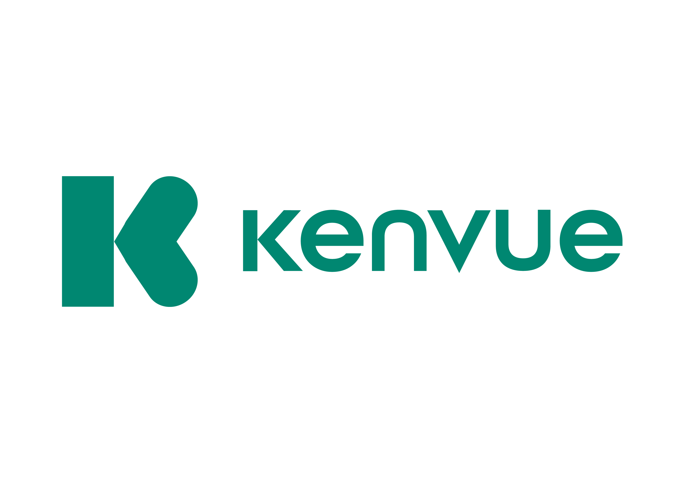

# Hi there! I'm Quintero 👋

## 🚀 About Me:
- Passionate about technology and constantly learning new things.
- Currently an Amazon Seller, focused on pet products.
- Skilled in software development.
- Experienced data analyst, recently certified in Microsoft Power BI.

## 🌟 Interests:
- Technology
- Hiking
- TV Series
- Cultures, Geography, and History

## 💼 Skills:

## 🚀 My Projects:

### [Project 1: Pairs game!](https://github.com/QuinteroDev/pairsGame)

**Description:** Game of pairs. Built with Vite and JavaScript.

### [Project 2: Logistic KPIs Dashboard](https://github.com/QuinteroDev/PowerBI_DataAnalysis)

**Description:** A powerful data visualization tool using DAX and Power BI to turn raw data into insightful charts and reports.

### [Project 3: Responsive LandingPage](https://github.com/QuinteroDev/landingPage)

**Description:** Responsive landing page with different resolutions. Built with Vite and Scss.

### [Project 4: Groceries LandingPage](https://github.com/QuinteroDev/landingGroceryStore)

**Description:** Static landing page of Grocery Store. Built with HTML and CSS.

## 🏢 Companies I've Worked For:

  
  
  
  

## 📫 How to reach me:
- Email: [info@quintero.cz](mailto:info@quintero.cz)
- LinkedIn: [Iván Ruiz](https://www.linkedin.com/in/iván-r-a921b3164)
- Twitter: [@ivanquinteroCZ](https://x.com/ivanquinteroCZ)

## 📊 GitHub Stats:

